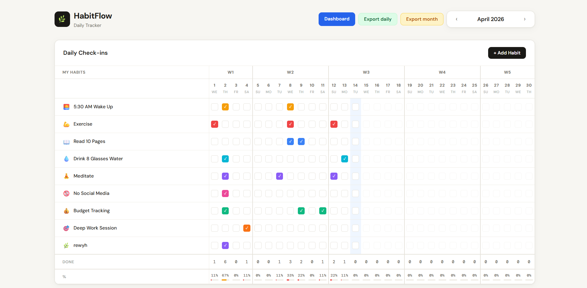
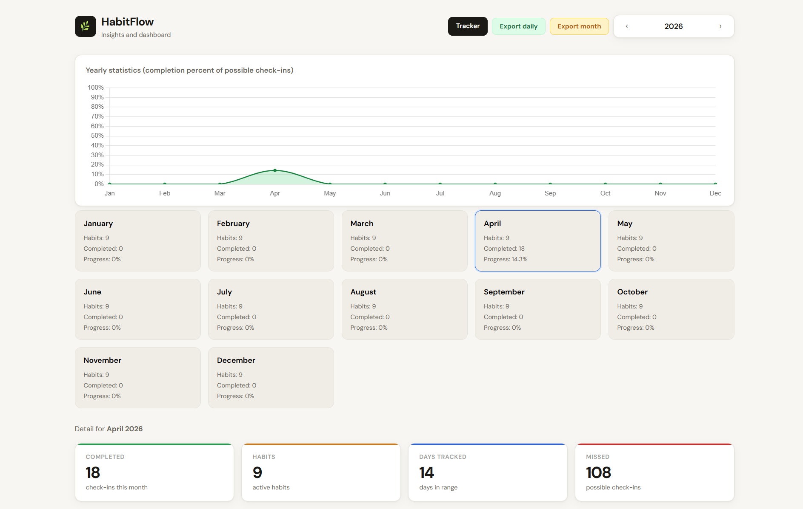
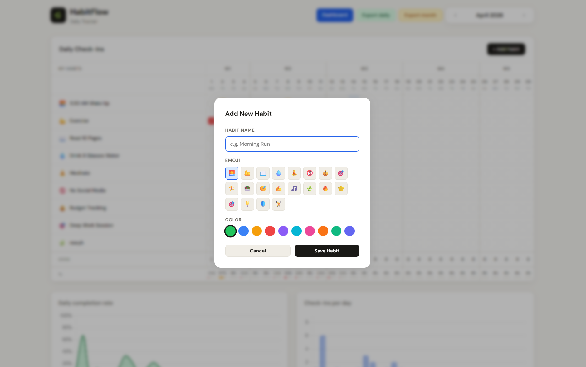

# HabitFlow

A small, self-hosted habit tracker. You run it on your computer, your data stays in a local SQLite file next to the app. The interface is a simple web app backed by a minimal Flask API.

## Why this exists

The idea is to **help people stay motivated** with a clear, low-friction way to log habits and see progress. A similar kind of app showed up on Instagram, but the creator was **asking for payment**. This repository is an **open-source alternative** inspired by that: same general goal—track daily habits and feel good about consistency—but **free to run, inspect, and change**. The goal stays simple: **your habits, your machine, no paywall.**

## Screenshots







## Project layout

```text
Daily-Tracker/
├── app.py                 # Web server, database setup, JSON API
├── habits.db              # Your data (SQLite); created on first run, not in git
├── requirements.txt       # Python dependencies (Flask)
├── LICENSE                  # Apache License 2.0
├── README.md
├── assets/                  # Screenshots and other static images for docs
│   └── screenshot.png       # Add your screenshot here (see “Screenshot” above)
└── templates/
    ├── index.html           # Tracker page: monthly grid, daily checkboxes, quick charts
    └── dashboard.html       # Dashboard: summaries, trends, exports for a chosen month
```

## How it works (high level)

- **Flask** (`app.py`) serves two pages: the **Tracker** at `/` and the **Dashboard** at `/dashboard`. Everything else is **JSON under `/api/...`** that the browser calls with JavaScript (no separate frontend build step).
- **SQLite** stores two kinds of things: **habits** (name, emoji, color, active flag) and **completions** (which habit was done on which date). The first time you run the app, if the database is empty, a few **example habits** are inserted so you can try the UI right away; you can edit or remove them on the Tracker page.
- **Tracker** is for **fast daily use**: pick a month, tick boxes per habit per day, and see small charts update as you log completions.
- **Dashboard** is for **the bigger picture**: KPIs, monthly progress, per-habit breakdowns, a yearly view, and **CSV exports** for the month you have selected (same export ideas exist on the Tracker for the current month view).
- **Exports** help you use the data elsewhere: one style is **one row per day**, another is a **month summary plus a habit-by-date grid**.

## What you get

- **Tracker** (`/`): monthly grid, checkboxes per habit and day, quick charts under the grid that update when you log completions.
- **Dashboard** (`/dashboard`): KPIs, monthly progress, per-habit analysis, snapshot stats, a yearly overview chart, and month cards. Use this when you want the big picture, not while doing fast daily entry.
- **Exports**: CSV export for the current month on the Tracker (`Export daily` is one row per day; `Export month` is a summary line plus a habit-by-date grid). The same exports exist on the Dashboard for whichever month you have selected.

## Requirements

- Python 3.10 or newer (3.x supported by Flask is fine).
- `pip` for dependencies.

## Quick start

```bash
cd Daily-Tracker
pip install -r requirements.txt
python app.py
```

Open **http://127.0.0.1:5050** in your browser.

The first run creates `habits.db` next to `app.py` and seeds a few example habits if the database is empty. You can edit or remove those on the Tracker page.

## Contributing

Issues and pull requests are welcome. Keep changes focused; match the existing style in `app.py` and the templates. If you add a feature, a short note in this README helps new users.

## License

This project is licensed under the **Apache License 2.0**; see the [`LICENSE`](LICENSE) file for the full text.
